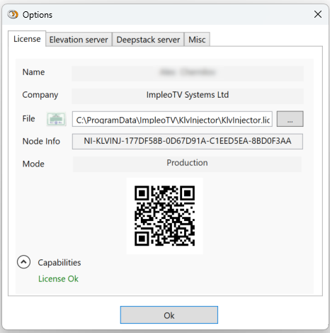

  

# KlvInjector

**KlvInjector™** video and telemetry processing tool for metadata insertion into FMV (Full Motion Video).  
More [info](https://impleotv.com/products/applications/klvinjector).

## System Requirements

OS: Windows 10 64 bit.

## Installation

**KlvInjector** can be downloaded as a **zip** file that contains installer.  
Unzip the **SetupKlvInjector.zip** file and run the **SetupKlvInjector.exe**  

## Download link

|          | Version             | Download link                                                           | 
|:---------|:-------------------:|:------------------------------------------------------------------------|
| **KlvInjector** |  v3.8.11 | [SetupKlvInjector.zip](https://github.com/impleotv/klvinjector-release/releases/latest/download/SetupKlvInjector.zip) | 

*Released on Sat, 18 Dec, 19:55 GMT+2*

## License

No license is needed for application evaluation - it will work in demo mode (with some restrictions).

**KlvInjector** is a node locked software, so you have to get a license (after purchasing the SW) in order to lift demo restrictions. Please install it and fill an [online form](https://docs.google.com/forms/d/e/1FAIpQLSd_XW6bDsFce1G1cpds4gMQNlwNax0CvkWzcMbscxZ5rLaIbA/viewform), providing the ***Node Info*** string (IMPORTANT!!!) for the target machine.  
***Node Info*** string can be found at ***Options->License***, as shown below.

Please copy-paste *Node Info*, don't send an image...

You'll get back a **license** file and a **key**.
Select the license file in the *Options/License* page and apply the provided key.
